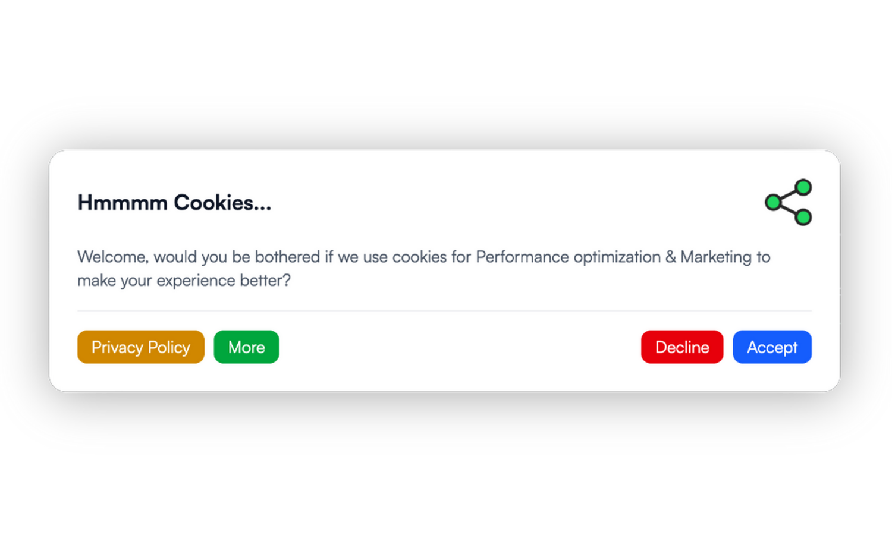
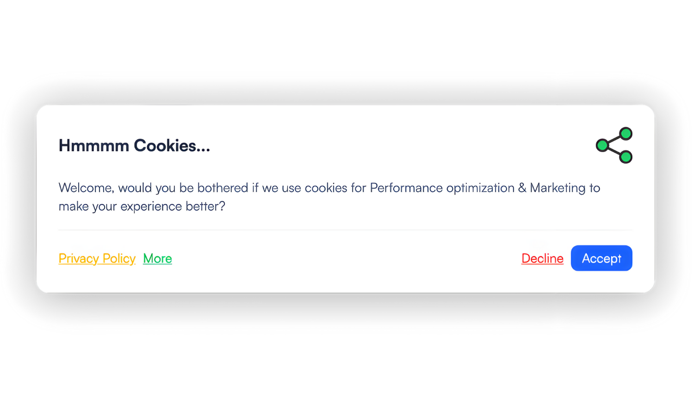
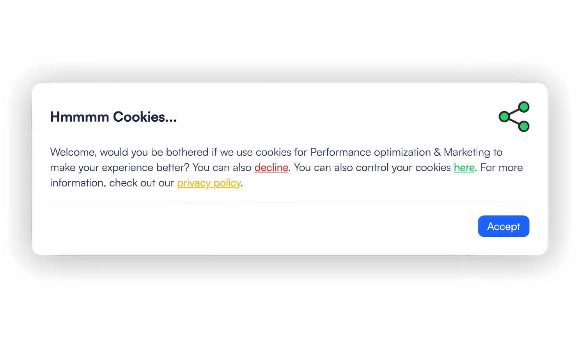

# Nuxt Consent Management Platform

A **customizable cookie consent management component** for [Nuxt
3](https://nuxt.com/).\
This package provides a single component you add at the **root of your
project** to handle cookie preferences and privacy compliance in a
modern, user-friendly way.

- Dependent on **^Tailwind V4**

Demo:\


## ✨ Features

-   Simple one-component setup
-   Initial modal shown on first visit with required consent choice
-   Preferences modal accessible via a fixed trigger button
    (bottom-left)
-   Fully configurable: texts, colors, buttons, categories, services
-   Dark mode support

## 📦 Installation

``` bash
npm install @olehendrix/nuxt-consent-management-platform
```

## 🔧 Setup

1.  Import the component once in your Nuxt app root (`app.vue`):

``` vue
<script setup lang="ts">
</script>

<template>
  <ConsentManagementPlatform />
  <NuxtPage />
</template>
```

2.  Copy the example config into your `nuxt.config.ts`:\
    👉
    [example.config.ts](https://github.com/OleHendrix/nuxt-consent-management-platform/blob/main/example.config.ts)

``` ts
// nuxt.config.ts

export default defineNuxtConfig({
  modules: ['@olehendrix/nuxt-consent-management-platform'],
  consentManagementPlatform: {
  cookieName: 'consent',
  cookieMaxAge: 60 * 60 * 24 * 365, // 1 year
  initialModal: {
    title: "Hmmmm Cookies...",
    logo: null,
    description: "Welcome, would you be bothered if we use cookies for {{ purposes }} to make your experience better?",
    decline: {
      type: 'button', // 'button' | 'link' | 'inline' | 'disabled'
      text: "Decline",
      color: 'red',
    },
    more: {
      type: 'button',
      text: "More",
      color: 'green',
    },
    privacyPolicy: {
      type: 'button',
      text: "Privacy Policy",
      color: 'yellow',
    },
    accept: {
      type: 'button', // 'button' | 'link'
      text: "Accept",
      color: 'blue',
    }
  },
  preferencesModal: {
    title: "Cookie Settings",
    description: "Manage your privacy preferences and cookie settings",
    logo: null,
    updatedAt: new Date().toISOString(),
    purposes: [
      {
        id: "services",
        title: "Services",
        description: "Essential services required for the website to work correctly.",
        services: [
          { id: "session", title: "Session", description: "...", required: true },
          { id: "consent-management", title: "Consent Management", description: "...", required: true }
        ]
      },
      {
        id: "performance-optimization",
        title: "Performance optimization",
        description: "Services that help improve site performance.",
        services: [
          { id: "matomo-analytics", title: "Matomo Analytics", description: "...", required: false }
        ]
      }
    ]
  }
}
```

3.  Add the following line to your `main.css` (adjust the relative path
    to `node_modules` depending on your setup):

``` css
@source "../../node_modules/@olehendrix/nuxt-consent-management-platform*.vue";
```
## Setup instruction:


## ⚙️ Configuration

The configuration is done via the `consentManagementPlatform` object.

### Example

``` ts
consentManagementPlatform: {
  cookieName: 'consent',
  cookieMaxAge: 60 * 60 * 24 * 365, // 1 year
  initialModal: {
    title: "Hmmmm Cookies...",
    logo: null,
    description: "Welcome, would you be bothered if we use cookies for {{ purposes }} to make your experience better?",
    decline: {
      type: 'button', // 'button' | 'link' | 'inline' | 'disabled'
      text: "Decline",
      color: 'red',
    },
    more: {
      type: 'button',
      text: "More",
      color: 'green',
    },
    privacyPolicy: {
      type: 'button',
      text: "Privacy Policy",
      color: 'yellow',
    },
    accept: {
      type: 'button', // 'button' | 'link'
      text: "Accept",
      color: 'blue',
    }
  },
  preferencesModal: {
    title: "Cookie Settings",
    description: "Manage your privacy preferences and cookie settings",
    logo: null,
    updatedAt: new Date().toISOString(),
    purposes: [
      {
        id: "services",
        title: "Services",
        description: "Essential services required for the website to work correctly.",
        services: [
          { id: "session", title: "Session", description: "...", required: true },
          { id: "consent-management", title: "Consent Management", description: "...", required: true }
        ]
      },
      {
        id: "performance-optimization",
        title: "Performance optimization",
        description: "Services that help improve site performance.",
        services: [
          { id: "matomo-analytics", title: "Matomo Analytics", description: "...", required: false }
        ]
      }
    ]
  }
}
```

👉 The full example is here:\
[example.config.ts](https://github.com/OleHendrix/nuxt-consent-management-platform/blob/main/example.config.ts)

## Config Fields

#### `cookieName`

The name of the cookie stored in the browser.

#### `cookieMaxAge`

The lifetime of the cookie (in seconds). Example above sets it to **1
year**.

#### `initialModal`

Shown on first visit when no consent cookie exists.
It **cannot be dismissed** until the user makes a choice.

-   **title, logo, description**
-   **decline, more, privacyPolicy, accept** -- Configurable
    buttons/links
    -   `type`: `"button" | "link" | "inline" | "disabled"`\
    -   `color`: Tailwind color (e.g. `"red"`, `"blue"`)\
    -   `inline`: Object to add an inline text with clickable
        word/phrase ("sneaky decline")

👉 **Note**: The `accept` button color is also used for the switches in
the preferences modal.

#### `preferencesModal`

The modal where the user can fine-tune their cookie preferences.

-   **title, description, logo, updatedAt** -- General modal info\
-   **purposes** -- Categories of services (e.g. Essential, Marketing,
    Analytics)
    -   Each purpose has `id`, `title`, `description`, and `services`\
    -   Each service has `id`, `title`, `description`, and `required`
        flag

## 📺 Examples

### All buttons

### With links

### Sneaky inline links


### Dark mode & logo support


## 🛠️ Available Composables

You can use the following composables to check consent state:

``` ts
const { isServiceEnabled, hasConsent, getAllPreferences } = useConsent()
```

-   **`isServiceEnabled(serviceId: string): boolean`**\
    Returns `true` if a specific service has been allowed.

-   **`hasConsent(): boolean`**\
    Returns `true` if the user has already made a choice.

-   **`getAllPreferences(): Record<string, boolean>`**\
    Returns an object with all service IDs and their boolean consent
    values.

------------------------------------------------------------------------

## 📜 License

MIT © [OleHendrix](https://github.com/OleHendrix)
